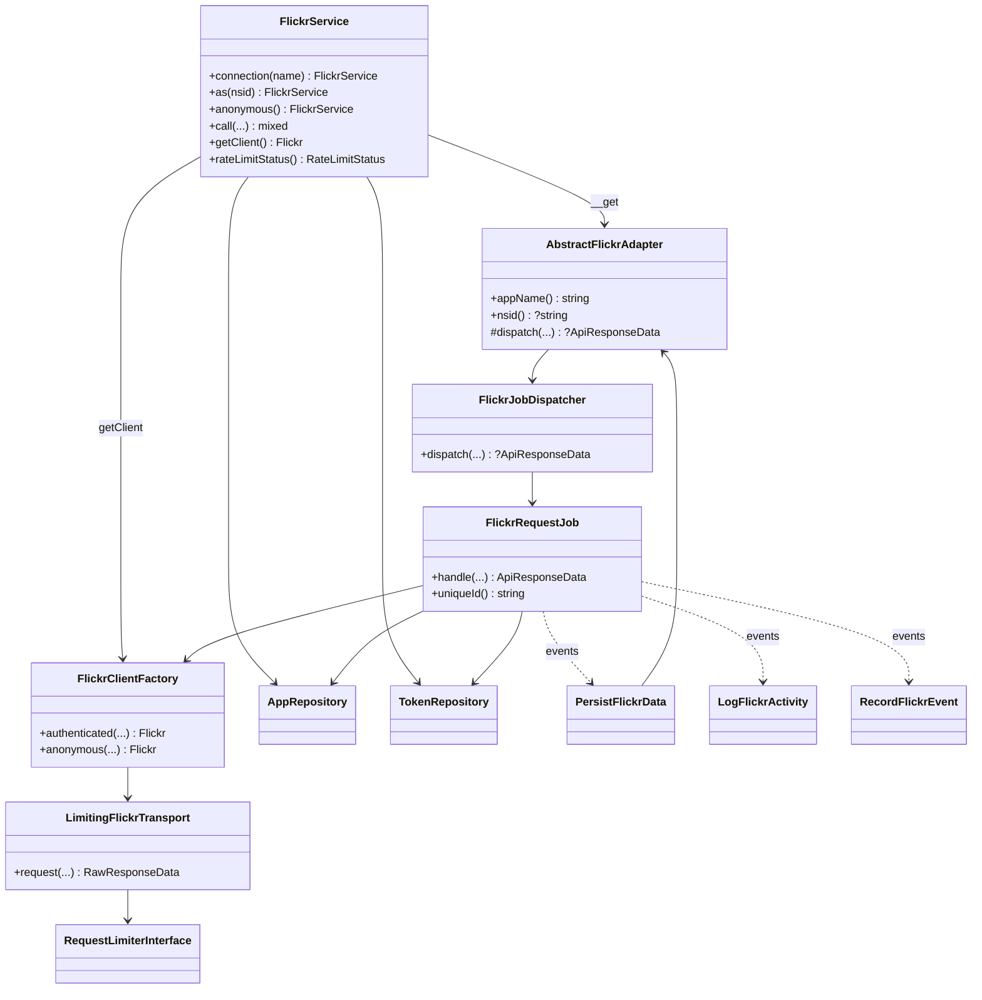

# Class map

## Core collaboration



## Adapter set

| Class | Namespace const | Persists? |
|---|---|---|
| `Photos` | `photos` | No |
| `People` | `people` | Yes (`getPhotos` / `getPublicPhotos`) |
| `Contacts` | `contacts` | Yes (`getList` only) |
| `Photosets` | `photosets` | Yes (`getPhotos`) |
| `Galleries` | `galleries` | Yes (`getPhotos`) |
| `Favorites` | `favorites` | Yes (`getList`) |
| `Test` | `test` | No |

Adapters that persist implement `PersistsResults` and are invoked by `PersistFlickrData` after `FlickrCallCompleted` — without re-validating tokens.

## OAuth

```text
FlickrOAuthAuthorizeCommand / host
        → OAuthService::authorize
        → PendingAuthorizationStore (encrypted Redis)
        → user authorizes on Flickr
        → OAuthCallbackController | FlickrOAuthCompleteCommand
        → OAuthService::complete
        → TokenRepository::store
        → FlickrOAuthCompleted
```

## Config resolvers

| Interface | Implementation | Source |
|---|---|---|
| `RateLimitConfigResolverInterface` | `LaravelConfigRateLimitResolver` | `flickr.rate_limit_*` |
| `RuntimeSettingsResolverInterface` | `LaravelConfigRuntimeSettingsResolver` | `flickr.*` runtime keys |

Shared casting: `Support\LaravelConfigValue`.
