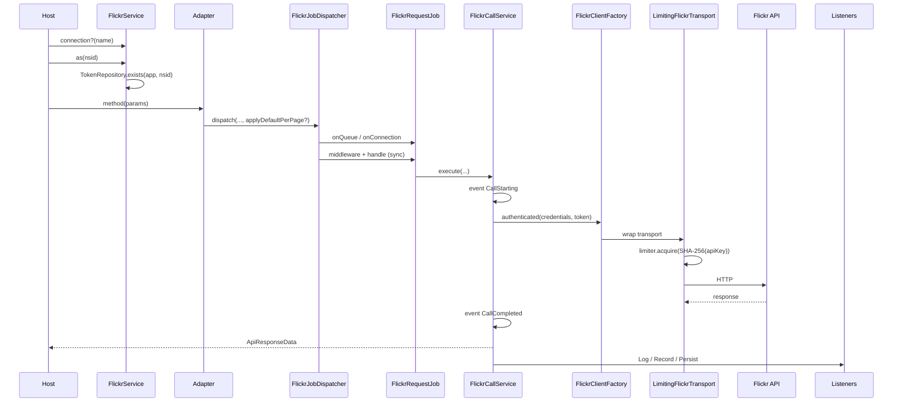
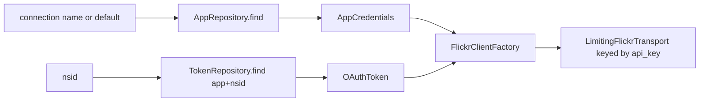
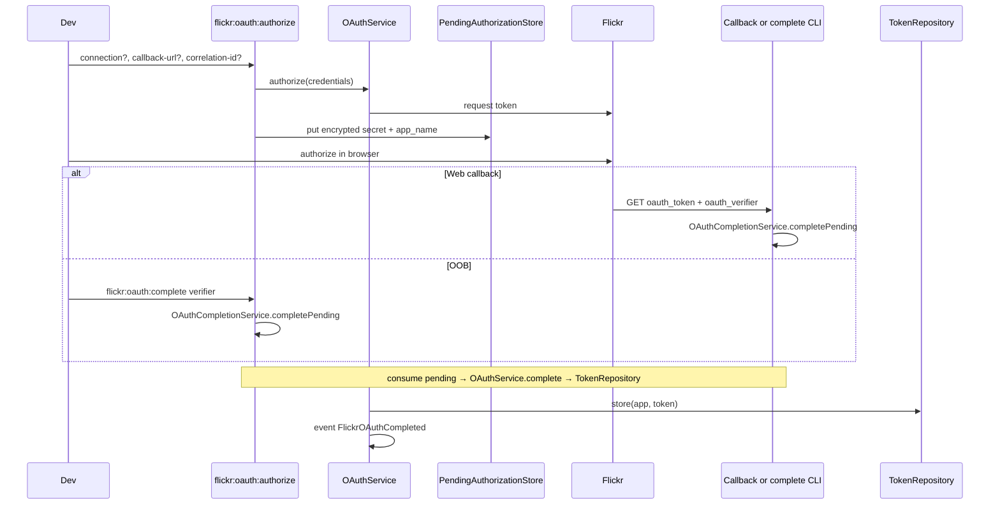

# Process / business flows

## 1. Authenticated API call (sync)

## 2. Queued call

Same as above until `FlickrJobDispatcher`: when `$queued = true`, the job is `dispatch()`ed to the queue named by `flickr.queue_name`. Workers run `handle()` → `FlickrCallService` with the same middleware and events. Callers observe outcomes via events, not return values.

**Uniqueness:** default `FlickrRequestJob` is **not** unique (retries and identical pages are not silently dropped). Opt in with `$unique = true` on `FlickrService::call()` / dispatcher, which uses `UniqueFlickrRequestJob` (`ShouldBeUnique`, 60s).

## 3. Multi-app resolution

## 4. OAuth (CLI OOB or web callback)

## 5. Rate limiting

Two layers, always active when the client is built by this package:

1. **Transport** (`LimitingFlickrTransport`) — `acquire()` before every HTTP call; 429 → `triggerCooldown` + `RateLimitedException`.
2. **Job middleware** (`FlickrRateLimitMiddleware`) — on denial: `release(retryAfter)` if queued, else rethrow.

Limiter: Redis Lua for atomic min-gap + hourly window. Disabled path (`flickr.rate_limit_enabled=false`) grants unlimited permits without recycling workers.

`FlickrRateLimitApproaching` fires **once** when usage crosses `warning_threshold_percent` for a connection key (transition), not on every later request. Transition state is cache-backed so multi-worker hosts share the same transition.

## 6. Persistence

On `FlickrCallCompleted`, `PersistFlickrData` resolves the adapter via `FlickrAdapterRegistry`. If the namespace is unknown or the adapter does not implement `PersistsResults`, the listener **no-ops** (never throws). This keeps the `FlickrService::call()` escape hatch safe after a successful Flickr HTTP response.

Soft-remove reconciliation is owned by `PersistenceReconcileService` (repositories only mark rows; the service emits domain events).
